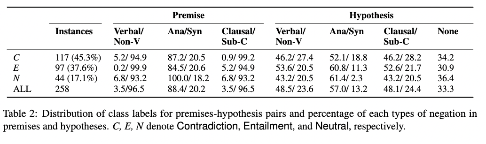

Code and data for the paper "Not another Negation Benchmark: The NaN-NLI Test Suite for Sub-clausal Negation" (AACL-ICJNLP 2022)

# NaN-NLI

The test suite is also available on the HuggingFace Hub at https://huggingface.co/datasets/joey234/nan-nli. To load using the `datasets` library:

	from datasets import load_dataset
	dataset = load_dataset("joey234/nan-nli")

# Run

	nli_infer.py -i data/nan.csv -m <model_name_or_path>

`model_name_or_path` in `joey234/cuenb-mnli, sileod/roberta-base-mnli, joey234/cuenb-mnli-negnli, joey234/roberta-base-mnli-negnli`