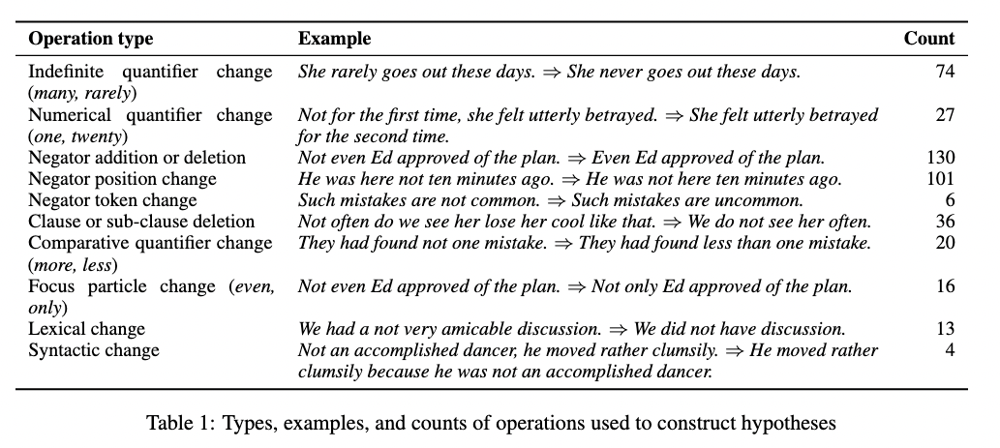

Code and data for the paper "Not another Negation Benchmark: The NaN-NLI Test Suite for Sub-clausal Negation" (AACL-ICJNLP 2022)

# NaN-NLI

# Run

	nli_infer.py -i data/nan.csv -m <model_name_or_path>

`model_name_or_path` in `roberta-base, joey234/cuenb, joey234/cuenb-mnli, sileod/roberta-base-mnli`  